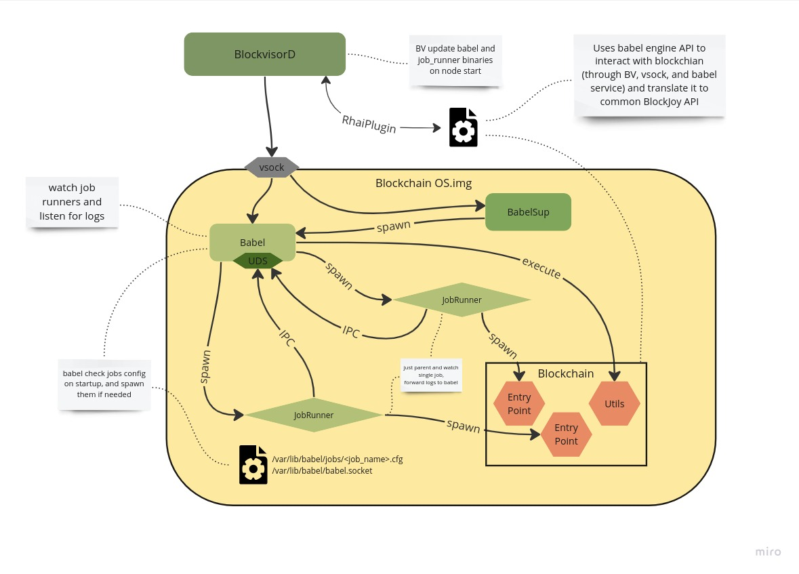
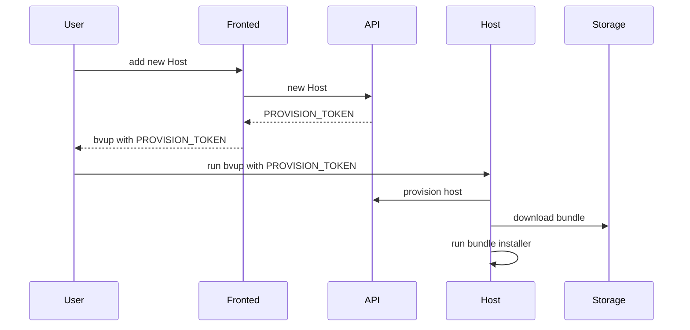
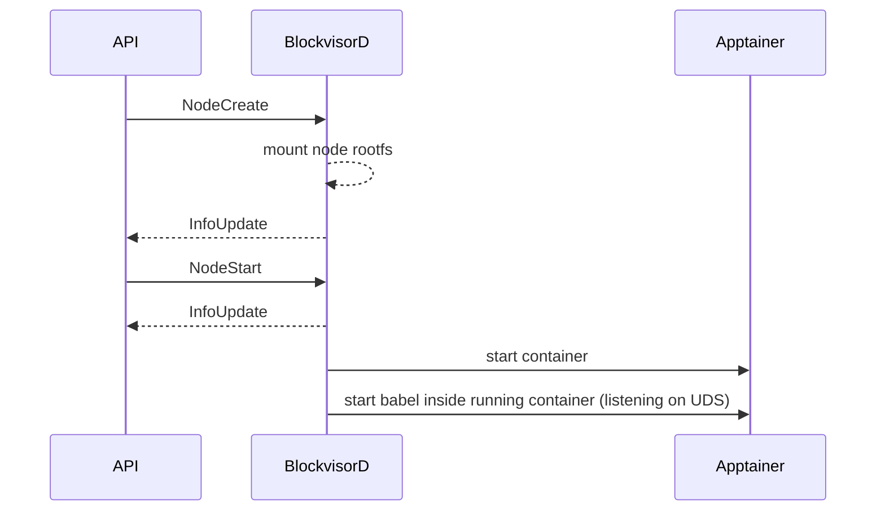
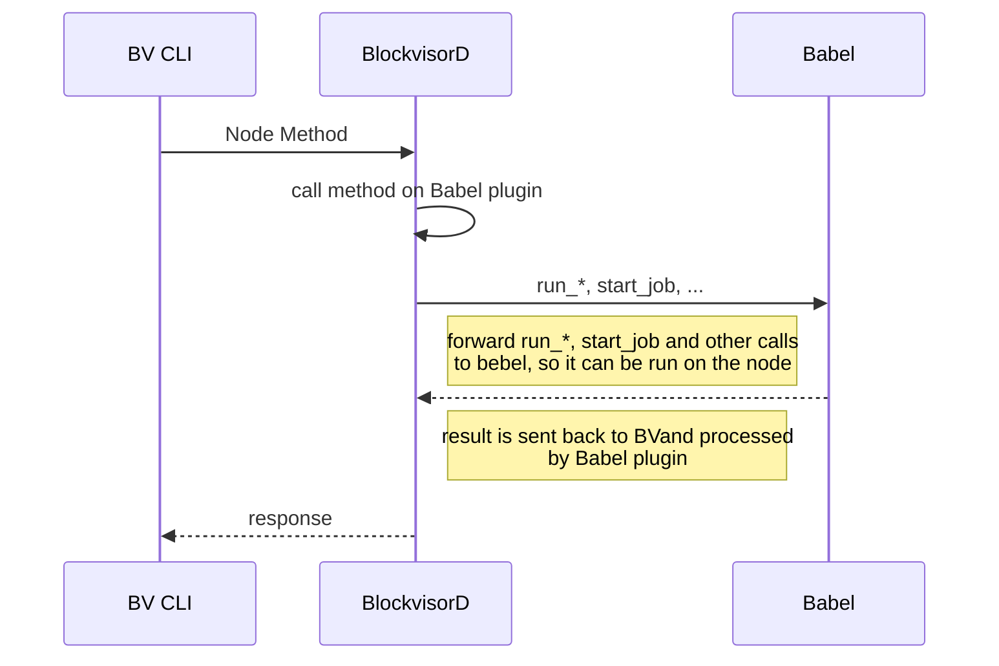
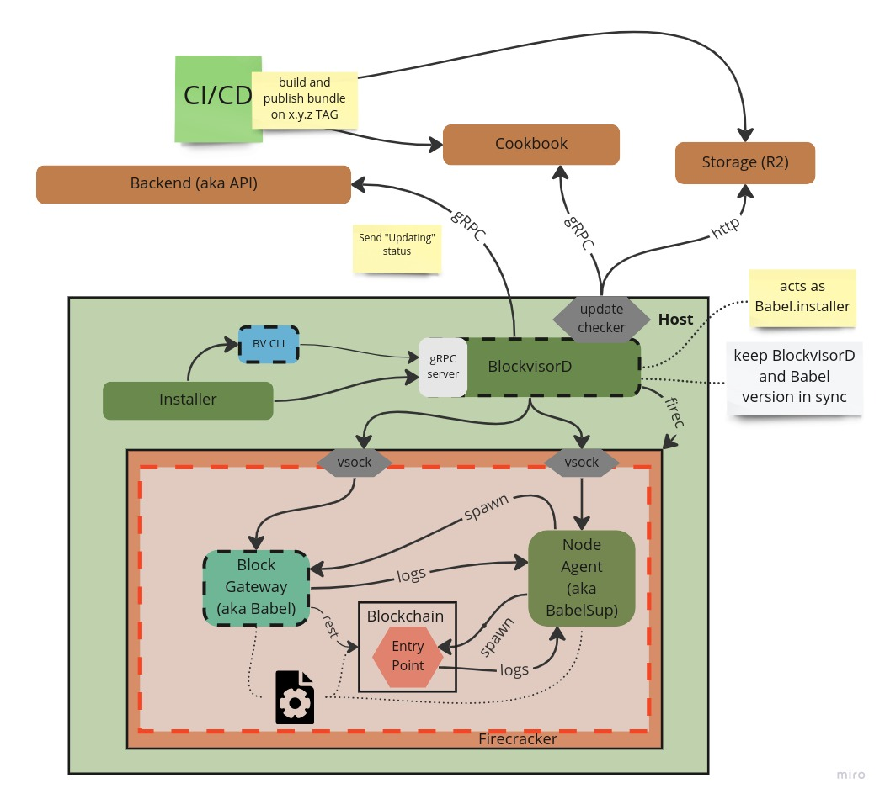
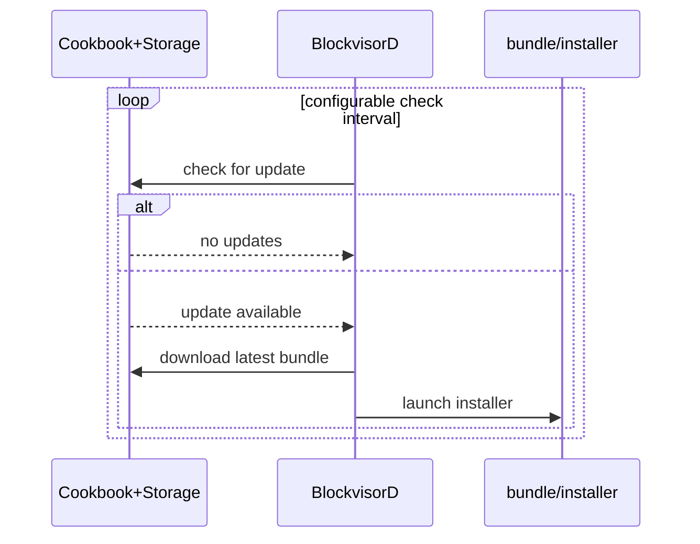
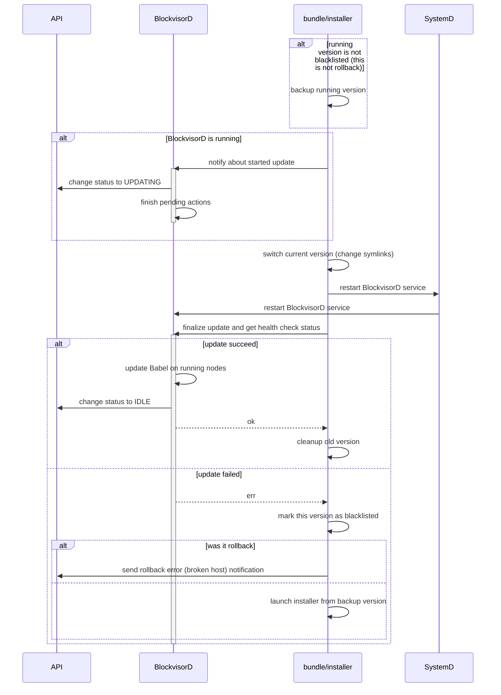
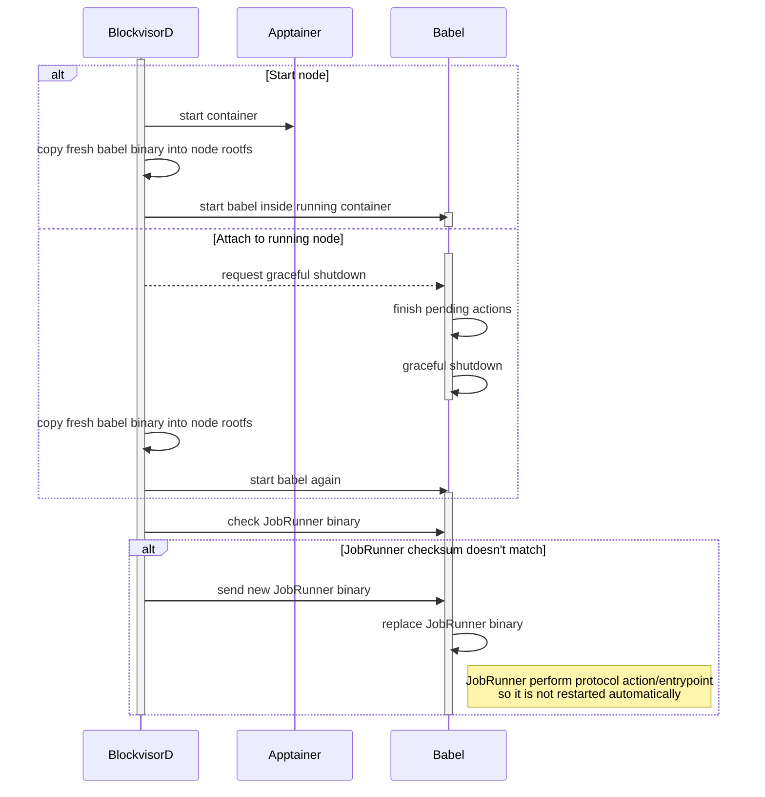

# BlockVisor

The service that runs on the host systems and is responsible for provisioning and managing one or more protocols on a single server.

## How to release a new version
1. Make sure you have installed:
   - `git-conventional-commits`: `nvm install node; npm install --global git-conventional-commits`
   - `cargo-release`: `cargo install cargo-release`
2. Run `cargo release --execute $(git-conventional-commits version)` 
3. CI `publish` workflow will then build a bundle and create a new GH release
4. Bundle is automatically deployed on DEV environment. When bundle is tested and ready to promote
on PROD environment, use `make promote-prod` (requires `AWS_ACCOUNT_ID, AWS_ACCESS_KEY_ID, AWS_SECRET_ACCESS_KEY, AWS_REGION` env variable set). 

## Host Setup

See [BlockVisor Host Setup Guide](host_setup_guide.md) for more details.

Published version of above guide with `bvup` tool can be found [here](https://github.com/blockjoy/bv-host-setup/releases).

## Babel Plugins

BV is protocol agnostic system that uses plugin system to add support for specific protocols.

So-called Babel Plugin, that translates BV protocol agnostic interface (aka Babel API) into protocol specific calls,
always comes together with node image.

See [Node Image Builder Guide](node_image_builder_guide.md) for more details on how to
add new protocol support to Blockvisor.

## API proto files

API proto files are stored in [separate repository](https://github.com/blockjoy/api-proto).

Note that [git submodules](https://github.blog/2016-02-01-working-with-submodules/) are used to bring the protos to this project.

```
git submodule update --init --recursive
```

## Log Levels Policy
- `error` - internal BV error (potential bug) or nonrecoverable error that requires manual actions;
error should rise alert
- `warn` - abnormal events that BV is capable to handle, e.g. networking issues, node recovery;
may be caused by external errors, but BV should recover when external system get back to normal
- `info` - main actions with minimum context, e.g. node created;
avoid for frequently recurring actions like sending node status
- `debug` - Detailed actions flow with variables, include recurring actions like sending node status;
used during debugging issues, not printed by default
- `trace` - debug messages used on development phase by devs

## Important Paths
### Host
- `/opt/blockvisor/blacklist` bundle versions that failed to be installed
- `/opt/blockvisor/current` symlink to current `<version>`
- `/opt/blockvisor/<version>/` whole bundle
- `/etc/blockvisor.json` generated by `bvup <PROVISION_TOKEN>`, but can be later modified
- `/etc/systemd/system/blockvisor.service`
- `/var/lib/blockvisor/nodes/state.json` nodes_manager state persistence
- `/var/lib/blockvisor/nodes/<uuid>/` node specific data
- `/var/lib/blockvisor/nodes/<uuid>/state.json` node state persistence
- `/var/lib/blockvisor/nodes/<uuid>/plugin.data` Babel plugin data persistence (see load_data/save_data functions in [RHAI plugin scripting guide](babel_api/rhai_plugin_guide.md))
- `/var/lib/blockvisor/nodes/<uuid>/rootfs/` node rootfs (from `os.img`)
- `/var/lib/blockvisor/nodes/<uuid>/data/` protocol data dir, bind to node `/blockjoy/`, persist node upgrade

### Node
- `/usr/bin/babel`
- `/usr/bin/babel_job_runner`
- `/etc/babel.conf`
- `/var/lib/babel/jobs/<job_name>/config.json`
- `/var/lib/babel/jobs/<job_name>/status.json`
- `/var/lib/babel/jobs/<job_name>/progress.json`
- `/var/lib/babel/jobs/<job_name>/logs`
- `/var/lib/babel/jobs_monitor.socket`
- `/var/lib/babel/node_env`
- `/var/lib/babel/post_setup.sh`
- `/var/lib/babel/plugin/*.rhai` node specific Babel plugin files
- `/blockjoy/.babel_jobs/` archive jobs (e.g. download) metadata dir, in particular `download.completed` file
- `/blockjoy/protocol_data/` directory where protocol data are downloaded (uploaded from)

### Bundle
- `bundle/installer`
- `bundle/babel/`
- `bundle/blockvisor/`

## Testing

See [BV tests](bv/tests/README.md) for more.

# High Level Overview


## Node Internals



## Basic Scenarios
### Add Host - Host Provisioning



### Add Node

#### Overview



### Execute Method on Node



### Self update processes



#### Check for update



#### BlockvisorD update



#### Babel and JobRunner install/update


