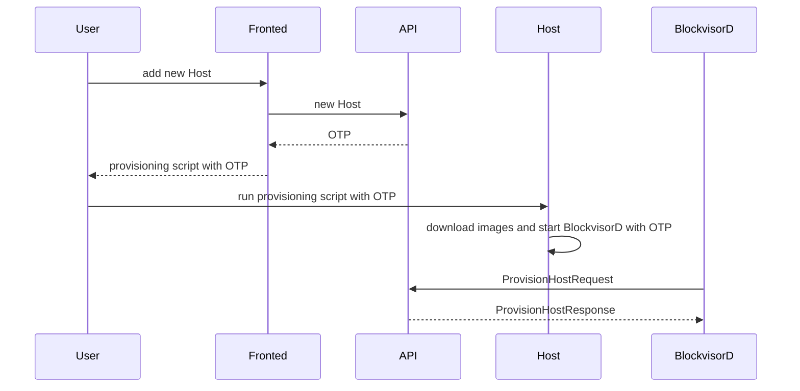
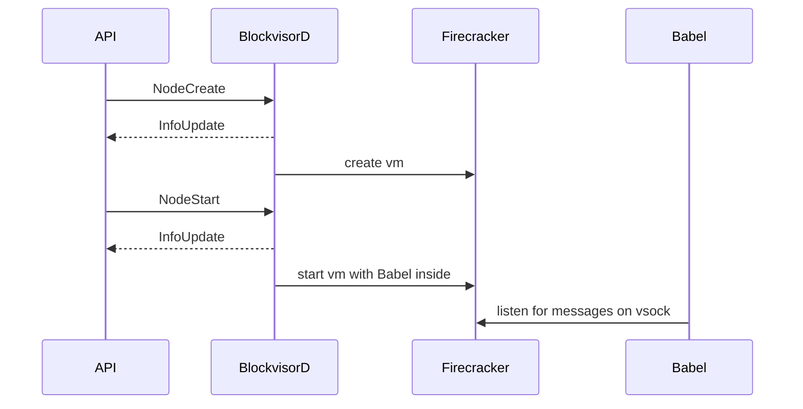
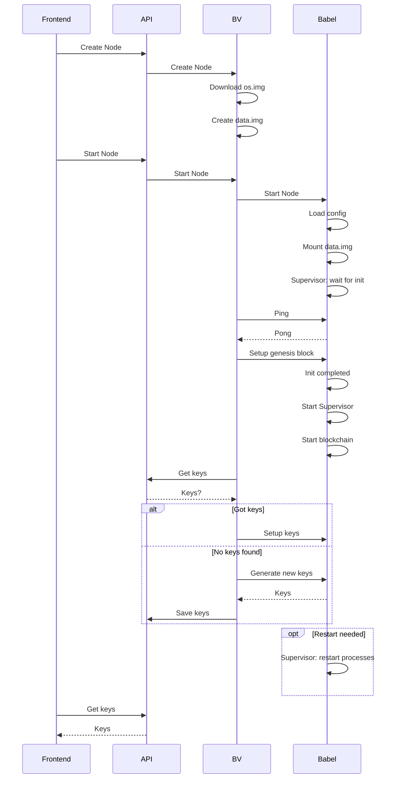
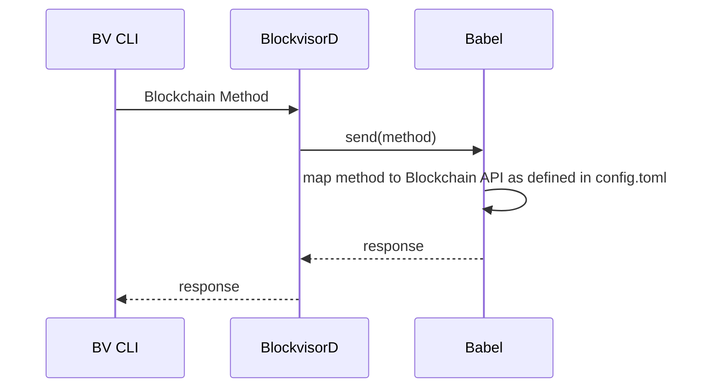
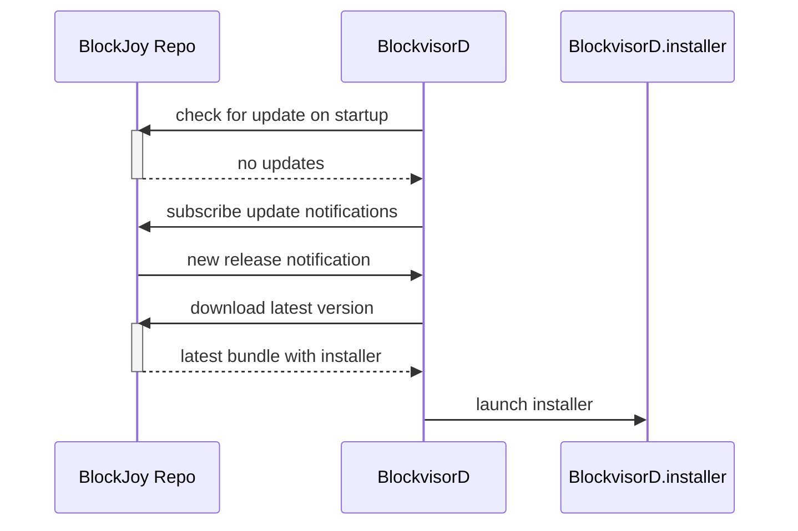
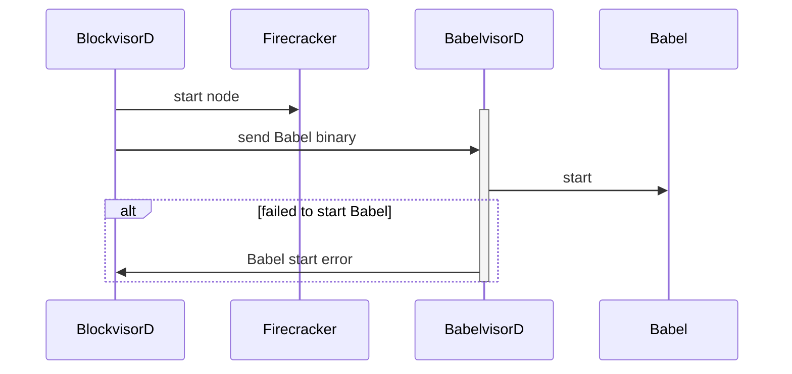
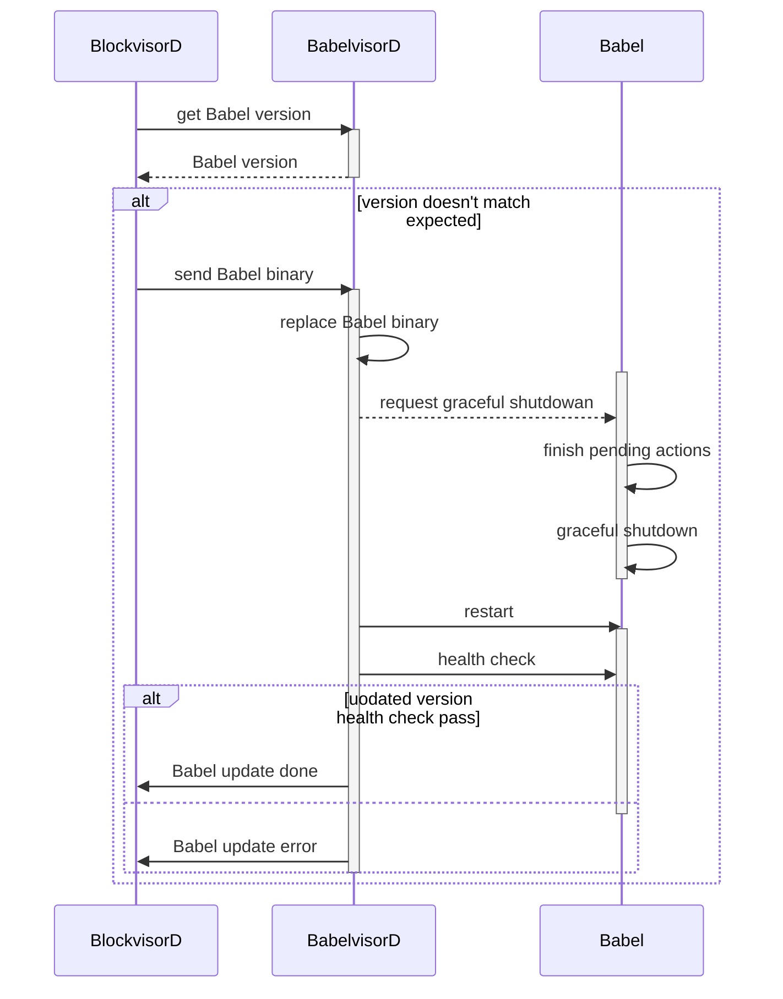

# BlockVisor

The service that runs on the host systems and is responisble for provisioning and managing one or more blockchains on a single server.

## How to release a new version

1. Update version in workspace
2. Run `make tag` to create a version tag
3. CI `publish` workflow will then build a bundle and create a new GH release

## API proto files

API proto files are stored in [separate repository](https://github.com/blockjoy/api-proto).

Note that [git submodules](https://github.blog/2016-02-01-working-with-submodules/) are used to bring the protos to this project.

```
git submodule update --init --recursive
```

# High Level Overview


# Basic Scenarios
## Add Host - Host Provisioning



## Add Node

### Overview



### More detailed view including key exchange and node initialization



## Execute Method on Blockchain



## Self update processes


### Check for update



### BlockvisorD update


### Babel install



### Babel update


