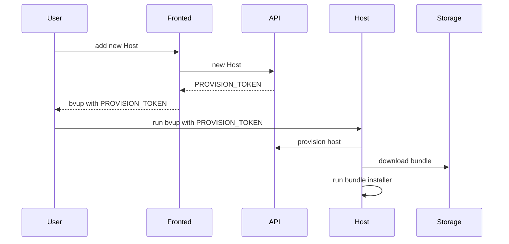
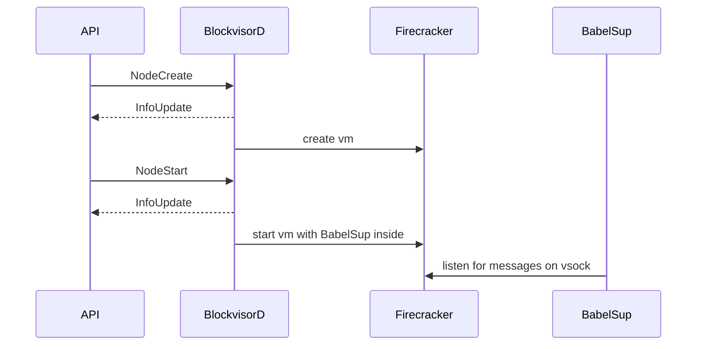
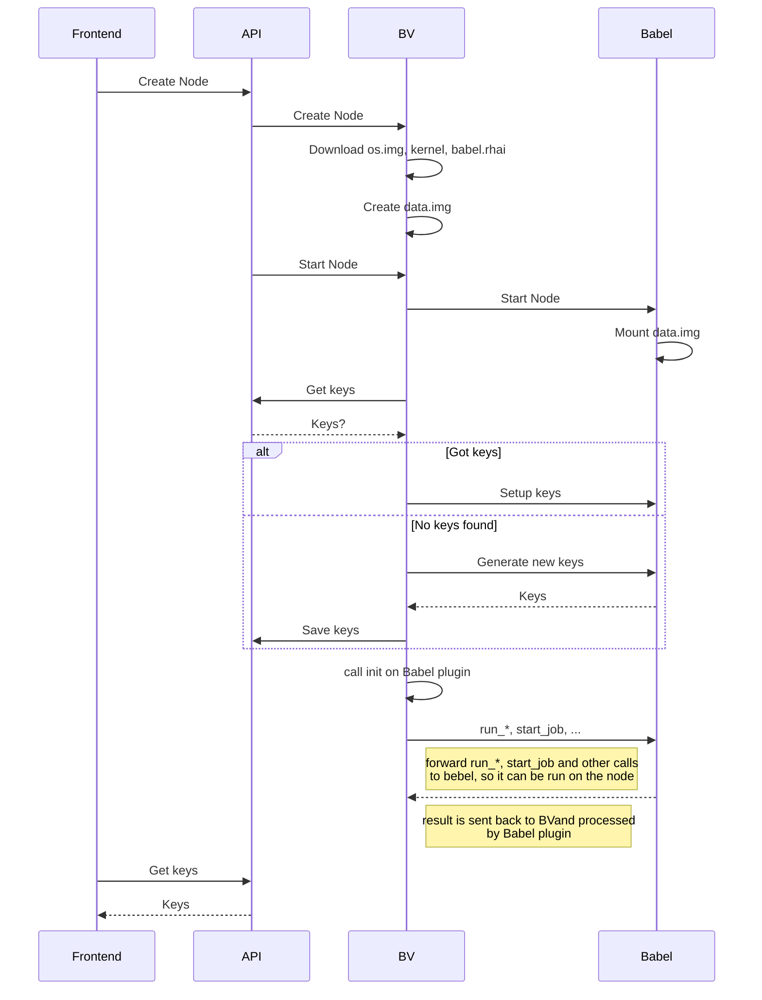
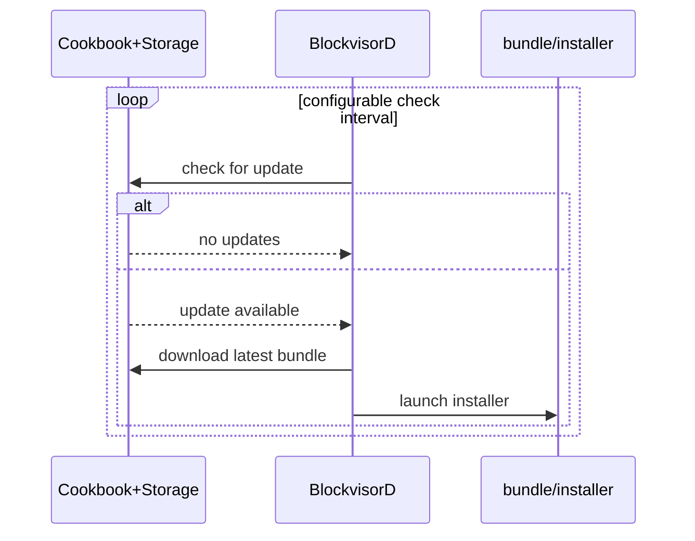
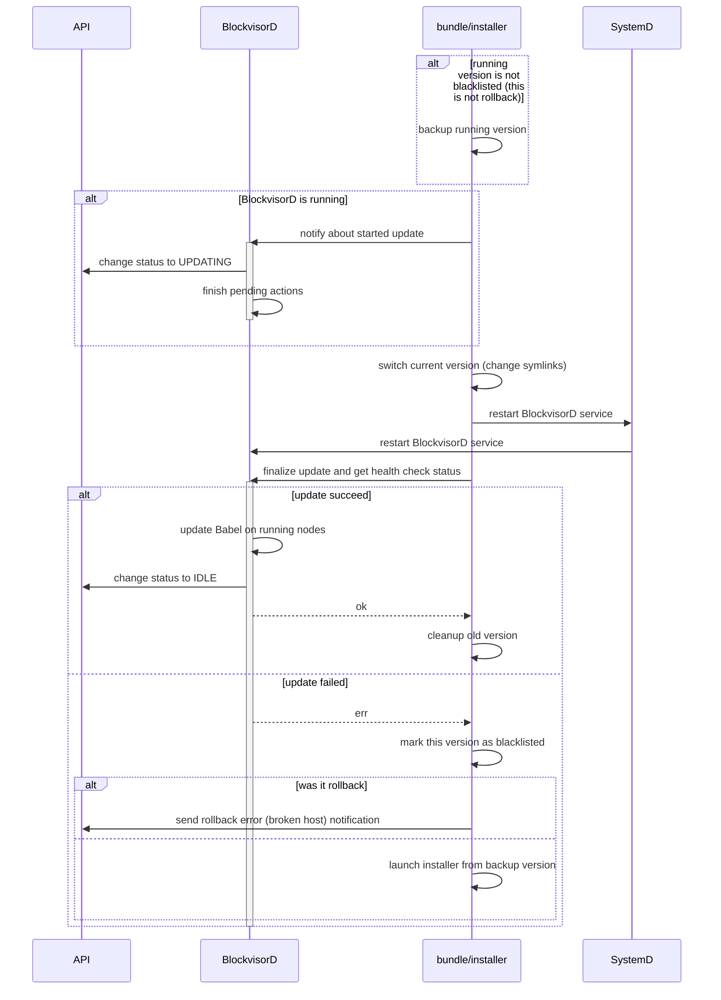
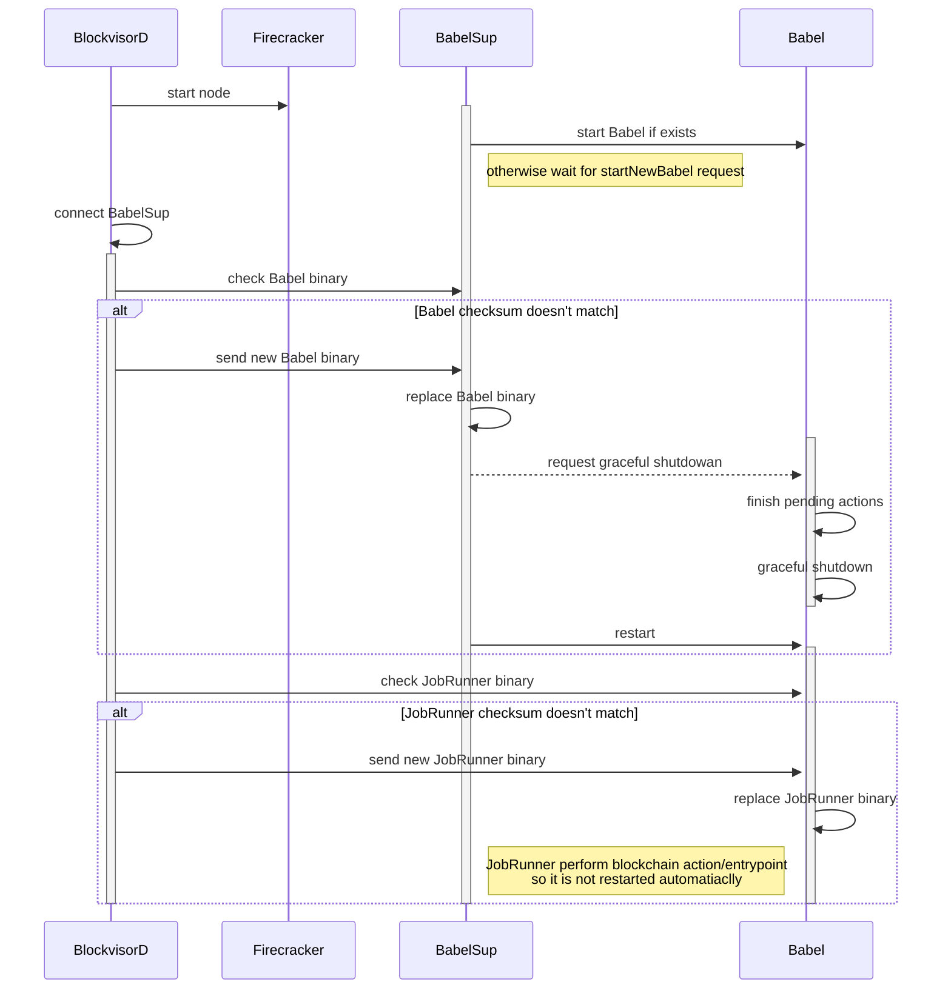

# BlockVisor

The service that runs on the host systems and is responsible for provisioning and managing one or more blockchains on a single server.

## How to release a new version
1. Make sure you have installed:
   - `git-conventional-commits`: `npm install --global git-conventional-commits`
   - `cargo-release`: `cargo install cargo-release`
2. Run `cargo release --execute $(git-conventional-commits version)` 
3. CI `publish` workflow will then build a bundle and create a new GH release

## Host Setup

### Prerequisites
 - networking is set up (including `bvbr0` bridge interface)
 - dependencies are installed `apt install tmux pigz util-linux e2fsprogs`
 - got `bvup` binary and **O**ne **T**ime **P**assword

```sh
./bvup <PROVISION_TOKEN> 
```
See `bvup --help` for more details.

## API proto files

API proto files are stored in [separate repository](https://github.com/blockjoy/api-proto).

Note that [git submodules](https://github.blog/2016-02-01-working-with-submodules/) are used to bring the protos to this project.

```
git submodule update --init --recursive
```

## Log Levels Policy
- `error` - internal BV error (potential bug) or nonrecoverable error that requires manual actions;
error should rise alert
- `warn` - abnormal events that BV is capable to handle, e.g. networking issues, node recovery;
may be caused by external errors, but BV should recover when external system get to normal
- `info` - main actions with minimum context, e.g. node created;
avoid for frequently recurring actions like sending node status
- `debug` - Detailed actions flow with variables, include recurring actions like sending node status;
used during debugging issues, not printed by default
- `trace` - debug messages used on development phase by devs

## Important Paths
### Host
- `/opt/blockvisor/blacklist` bundle versions that failed to be installed
- `/opt/blockvisor/current` symlink to current `<version>`
- `/opt/blockvisor/<version>/` whole bundle
- `/etc/blockvisor.json` generated by `bvup <PROVISION_TOKEN>`, but can be later modified
- `/etc/systemd/system/tmux.service`
- `/etc/systemd/system/blockvisor.service`
- `/var/lib/blockvisor/nodes.json`
- `/var/lib/blockvisor/nodes/<uuid>.json` node specific metadata
- `/var/lib/blockvisor/nodes/<uuid>.rhai` node specific Babel plugin
- `/var/lib/blockvisor/nodes/<uuid>.data` Babel plugin specific data
- `/var/lib/blockvisor/firecracker/<uuid>/` node specific firecracker data (e.g. copy of images)
- `/var/lib/blockvisor/images/<protocol>/<node_type>/<node_version>/`

### Node
- `/usr/bin/babel`
- `/usr/bin/babelsup`
- `/usr/bin/babel_job_runner`
- `/etc/babelsup.conf`
- `/etc/babel.conf`
- `/etc/systemd/system/babelsup.service`
- `/var/lib/babel/jobs`
- `/var/lib/babel/logs.socket`

### Bundle
- `bundle/installer`
- `bundle/babel/`
- `bundle/blockvisor/`
- `bundle/firecracker/`

## Testing

See [BV tests](bv/tests/README.md) for more.

# High Level Overview


## Node Internals


## Basic Scenarios
### Add Host - Host Provisioning



### Add Node

#### Overview



#### More detailed view including key exchange and node initialization



### Execute Method on Blockchain


### Self update processes


#### Check for update



#### BlockvisorD update



#### Babel and JobRunner install/update


