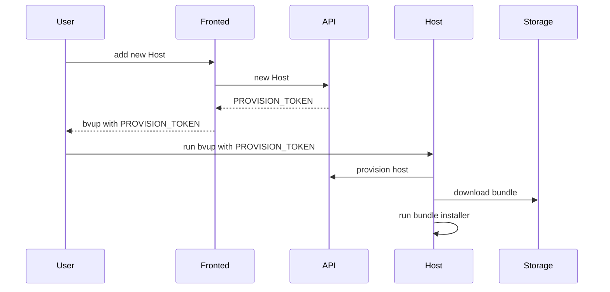
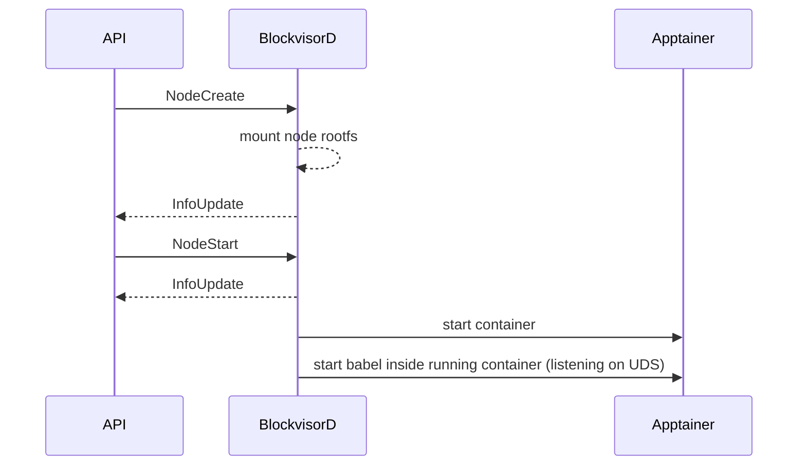
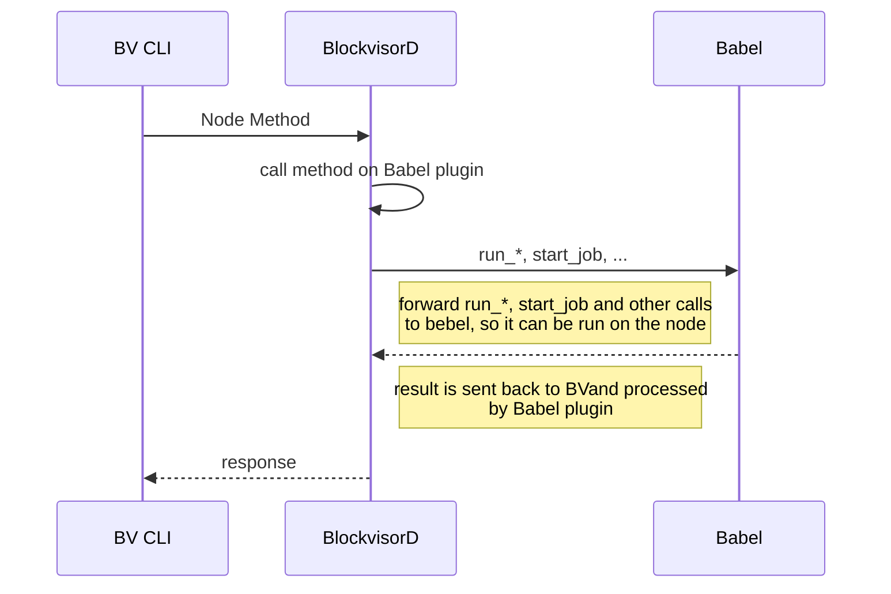
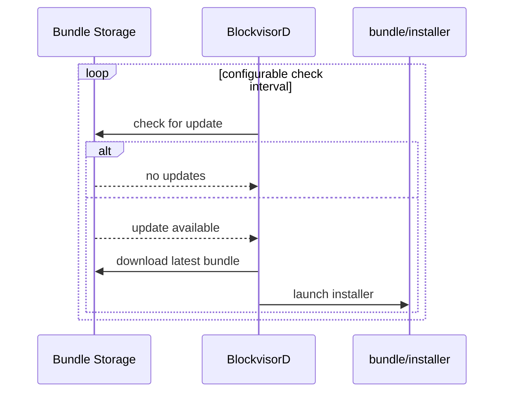
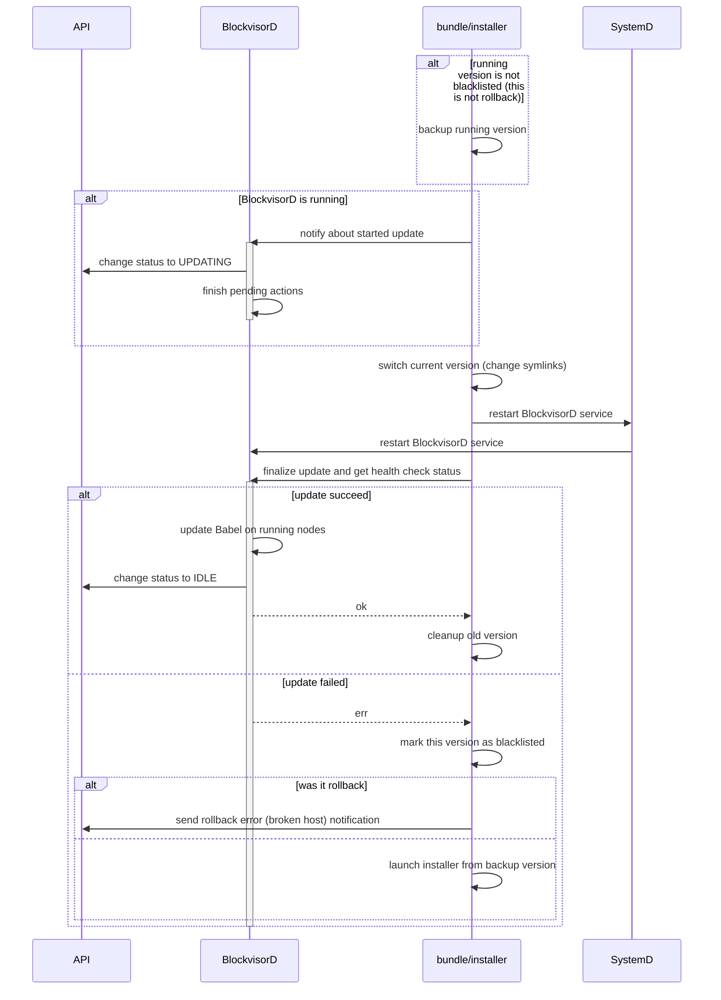
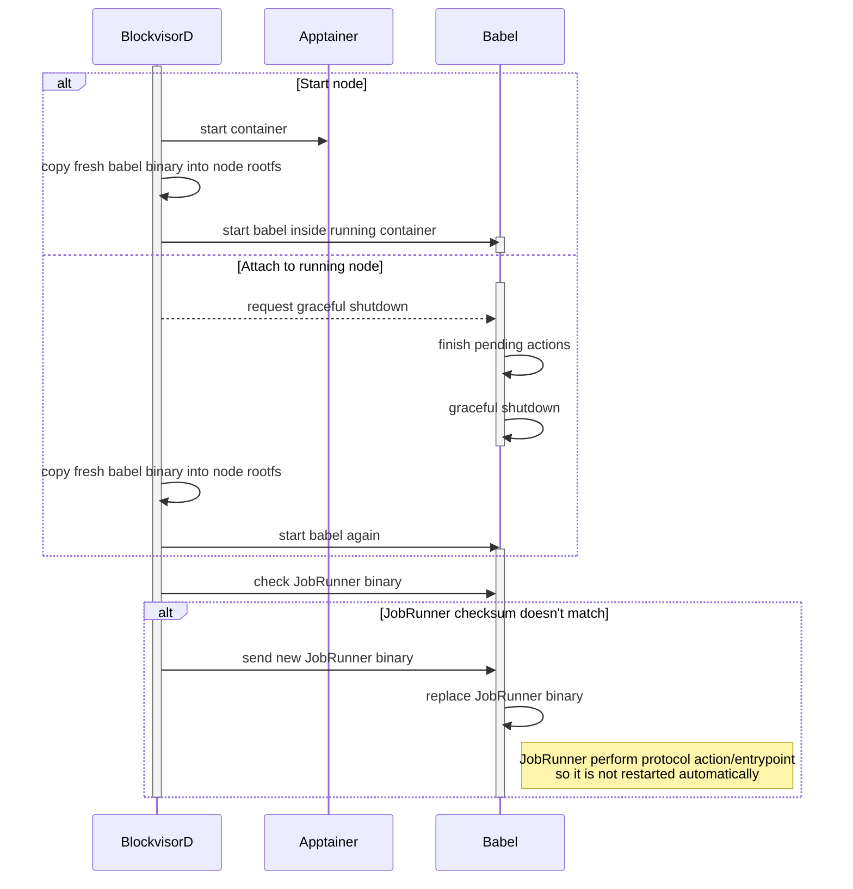
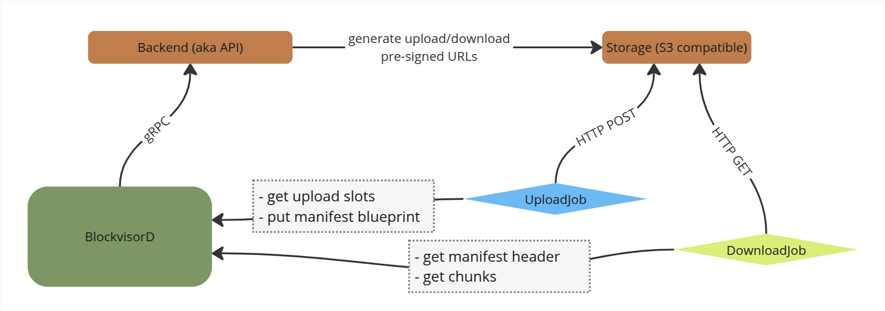
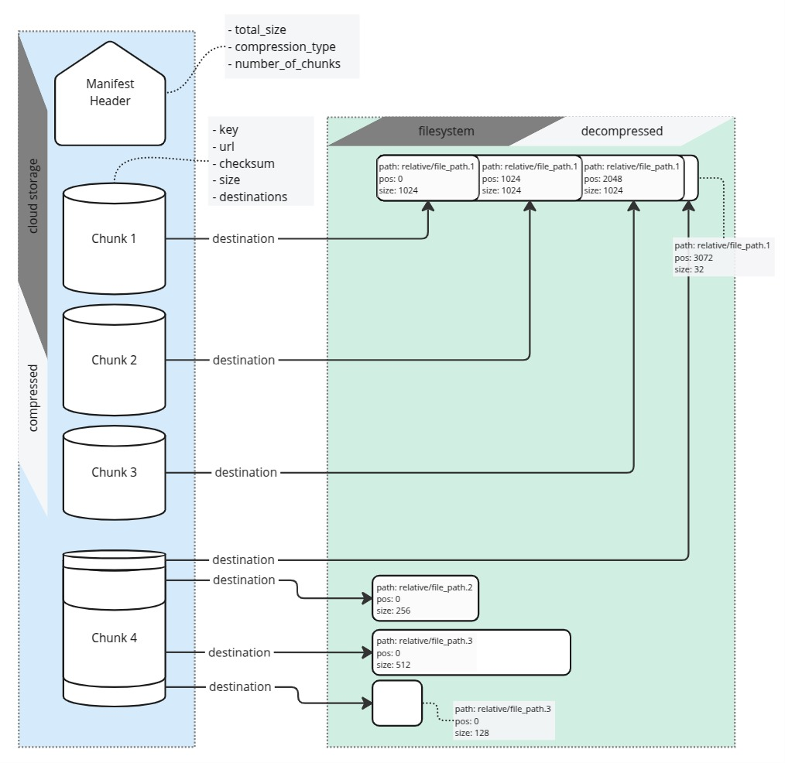
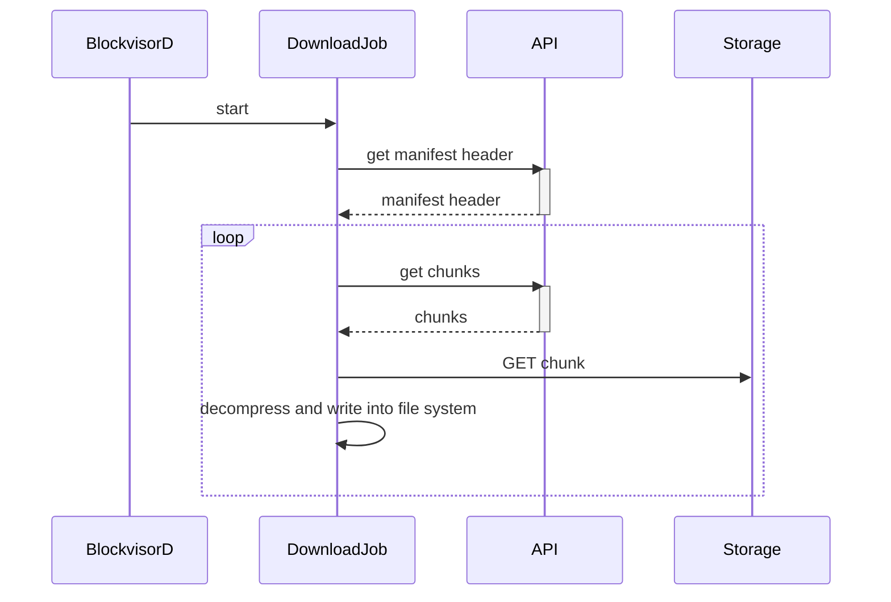
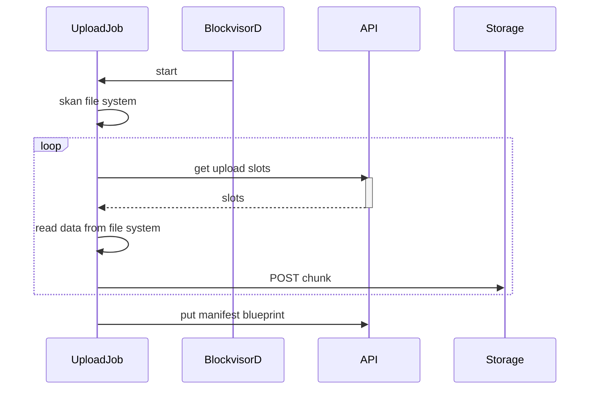

# BlockVisor

The service that runs on the host systems and is responsible for provisioning and managing one or more protocols on a single server.

## How to release a new version
1. Make sure you have installed:
   - `git-conventional-commits`: `nvm install node; npm install --global git-conventional-commits`
   - `cargo-release`: `cargo install cargo-release`
2. Run `cargo release --execute $(git-conventional-commits version)` or simply `make new-release` 
3. CI `publish` workflow will then build a bundle and create a new GH release
4. Bundle is automatically deployed on DEV environment. When bundle is tested and ready to promote
on STAGING or PROD environment, use `make promote-staging`/`make promote-prod` (requires `AWS_ACCOUNT_URL, AWS_ACCESS_KEY_ID, AWS_SECRET_ACCESS_KEY, AWS_REGION` env variable set). 

## Host Setup

See [BlockVisor Host Setup Guide](host_setup_guide.md) for more details.

Published version of above guide with `bvup` tool can be found [here](https://github.com/blockjoy/bv-host-setup/releases).

## Babel Plugins

BV is protocol agnostic system that uses plugin system to add support for specific protocols.

So-called Babel Plugin, that translates BV protocol agnostic interface (aka Babel API) into protocol specific calls,
always comes together with node image.

See [Node Image Builder Guide](node_image_builder_guide.md) for more details on how to
add new protocol support to Blockvisor.

## API proto files

API proto files are stored in [separate repository](https://github.com/blockjoy/api-proto).

Note that [git submodules](https://github.blog/2016-02-01-working-with-submodules/) are used to bring the protos to this project.

```
git submodule update --init --recursive
```

## Log Levels Policy
- `error` - internal BV error (potential bug) or nonrecoverable error that requires manual actions;
error should rise alert
- `warn` - abnormal events that BV is capable to handle, e.g. networking issues, node recovery;
may be caused by external errors, but BV should recover when external system get back to normal
- `info` - main actions with minimum context, e.g. node created;
avoid for frequently recurring actions like sending node status
- `debug` - Detailed actions flow with variables, include recurring actions like sending node status;
used during debugging issues, not printed by default
- `trace` - debug messages used on development phase by devs

## Important Paths
### Host
- `/opt/blockvisor/blacklist` bundle versions that failed to be installed
- `/opt/blockvisor/current` symlink to current `<version>`
- `/opt/blockvisor/<version>/` whole bundle
- `/etc/blockvisor.json` generated by `bvup <PROVISION_TOKEN>`, but can be later modified
- `/etc/systemd/system/blockvisor.service`
- `/var/lib/blockvisor/nodes/state.json` nodes_manager state persistence
- `/var/lib/blockvisor/nodes/<uuid>/` node specific data
- `/var/lib/blockvisor/nodes/<uuid>/state.json` node state persistence
- `/var/lib/blockvisor/nodes/<uuid>/plugin.data` Babel plugin data persistence (see load_data/save_data functions in [RHAI plugin scripting guide](babel_api/rhai_plugin_guide.md))
- `/var/lib/blockvisor/nodes/<uuid>/plugin_config.json` Babel plugin config persistence
- `/var/lib/blockvisor/nodes/<uuid>/rootfs/` node rootfs
- `/var/lib/blockvisor/nodes/<uuid>/data/` protocol data dir, bind to node `/blockjoy/`, persist node upgrade

### Node
- `/usr/bin/babel`
- `/usr/bin/babel_job_runner`
- `/etc/babel.conf`
- `/var/lib/babel/jobs/<job_name>/config.json`
- `/var/lib/babel/jobs/<job_name>/status.json`
- `/var/lib/babel/jobs/<job_name>/progress.json`
- `/var/lib/babel/jobs/<job_name>/logs`
- `/var/lib/babel/jobs_monitor.socket`
- `/var/lib/babel/node_env`
- `/var/lib/babel/post_setup.sh`
- `/var/lib/babel/plugin/*.rhai` node specific Babel plugin files
- `/blockjoy/.babel_jobs/` archive jobs (e.g. download) metadata dir
- `/blockjoy/.protocol_data.lock` protocol data lock file `touch`ed whenever service using that data is started 
- `/blockjoy/protocol_data/` directory where protocol data are downloaded (uploaded from)

### Bundle
- `bundle/installer`
- `bundle/babel/`
- `bundle/blockvisor/`

## Testing

See [BV tests](bv/tests/README.md) for more.

# High Level Overview


## Node Internals


## Basic Scenarios
### Add Host - Host Provisioning



### Add Node

#### Overview



### Execute Method on Node



### Self update processes


#### Check for update



#### BlockvisorD update



#### Babel and JobRunner install/update



### Protocol Data Snapshots

#### Overview

Blockvisor includes protocol data snapshot tooling, optimized for large datasets. It enables automated uploads and downloads
of dataset snapshots to S3-compatible object storage. This allows much quicker node provisioning by using pre-downloaded data.

Blockvisor is agnostic of dataset structure, which may vary form protocol to protocol. On the other hand, cloud storage has limitations (e.g. on single object size). Additionally, dataset structure may not be optimal for massive data uploads or downloads.

Hence, Blockvisor transforms filesystem data into list of chunks optimized for cloud transfer and storage. All necessary
metadata mappings are stored in the download manifest. 
Splitting the data into chunks enables concurrency and parallelism for the upload and download process, effectively speeding up the transfer while also maintaining compliance with cloud storage provider rate-limits. Because each provider has a different approach around limitations, the upload function may be fine-tuned according to each provider's requirements. Also, the chunks are compressed on the fly, which further reduces the amount of data that needs to be transferred, required storage and transfer times.

An upload can run from any node running on a host that has the necessary upload permissions. It can be triggered manually with
`bv node run upload` command, or periodically from an external cron-like job or from an internal, scheduled rhai task.
See [Protocol Data Archives](babel_api/rhai_plugin_guide.md/#protocol-data-archives) and [Default upload](babel_api/rhai_plugin_guide.md/#default-upload) for more details on the built-in upload function.

Download is ran as part of node initialization (see [Default init](babel_api/rhai_plugin_guide.md/#default-init) for more details).
If protocol data is not downloaded yet (or initialized in other way) and there is a snapshot available for the node image variant,
a download job will be started automatically. The jobs that are configured on the node which affect and use blockchain data will depend on the download function and will be started once it's completed.

#### Cloud Storage Abstraction

While it's the API that manages cloud storage access, Blockvisor doesn't authenticate with the cloud storage directly, rather it gets pre-signed urls form the API whenever it needs to upload or download datasets. That enables central access management and easier switching of S3 compatible cloud storage providers.



#### Manifest - data mapping

The datasets are split into chunks whose parameters are computed for compatibility with the cloud storage provider. The way chunks will get reassembled, what the file locations are and other metadata is stored in download manifest.
Each chunk may map into part of a single file or multiple files (i.e. original disk representation).
Downloaded chunks, after decompression, are written into disk location(s) described by the destinations included in metadata.

Example of chunk-file mapping:



#### Node-Snapshot Mapping

A specific data snapshot is associated with a given node variant via the `storage_key` field in the node `babel.yaml`.
Based on that the API knows which data set matches the node that is requesting the data from any given image variant.

Usually, in order to keep dataset up to date, uploads should be triggered periodically (e.g. via a scheduled task). In order to account for these consecutive uploads, the API will automatically version the datasets.

Note: The API itself or Blockvisor won't handle any cleanups of old datasets, it's your responsibility to ensure that old datasets are removed when they are no longer needed.

#### Chunks Granularity Impact

While in theory chunk size can be arbitrary, in practice it may have significant impact on upload/download
performance and reliability. Smaller chunks generate bigger manifest (more chunks to describe), but bigger chunks are harder
to upload in single POST request. In the upload case, chunks size has also direct impact on memory consumption.
If compression is enabled, chunk size is not known upfront, so the uploader needs to read all data into memory before being uploaded.
As a consequence, memory consumption may rise up to the chunk size times the number of max_runners.
Empirically, it was determined that chunk size around 500MB works best for mainstream cloud providers.

#### DownloadJob Steps

1. get manifest header
2. ask API for a couple of chunks (with presigned urls)
3. run parallel workers (number of workers defined by `max_runners` field in DownloadJob config)
4. each worker:
    - download chunk data from presigned url
    - decompress on it the fly and pass to writer thread
5. go back to step 2. or writer put data it into file system according to destination metadata form manifest



#### UploadJob Steps

1. scan protocol data and prepare manifest blueprint
2. ask API for a couple of upload slots (with presigned urls)
3. run parallel workers (number of workers defined by `max_runners` field in UploadJob config)
4. each worker:
    - read data from FS and compress it
    - upload chunk to presigned url
5. go back to step 2. or send manifest blueprint to API


