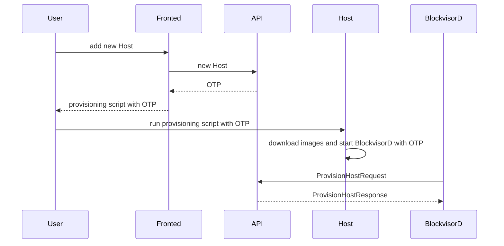
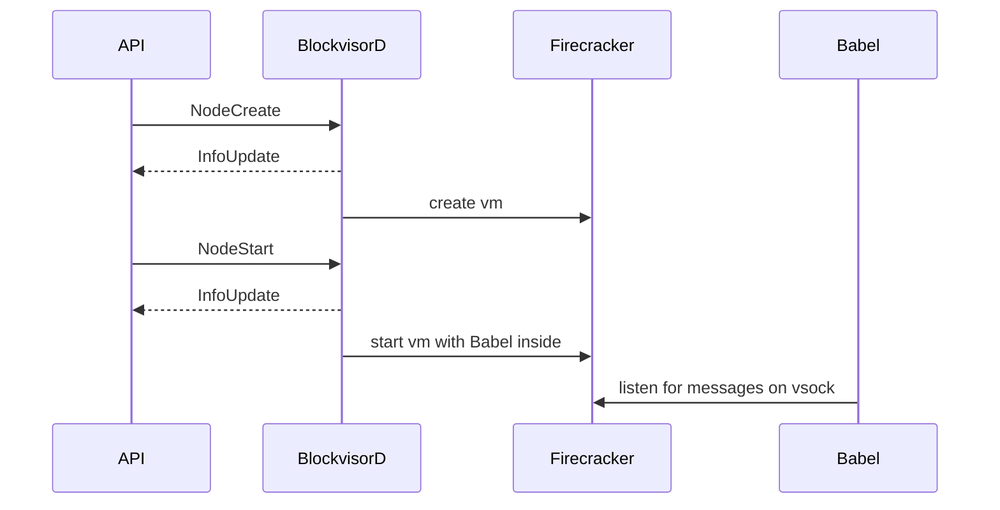
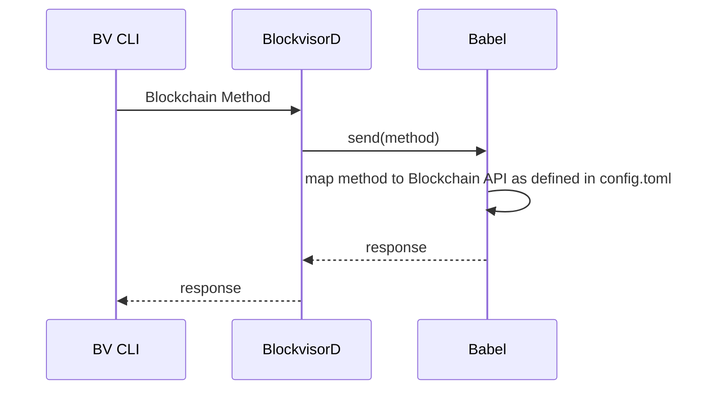

# BlockVisor

The service that runs on the host systems and is responisble for provisioning and managing one or more blockchains on a single server.

## API proto files

API proto files are stored in [separate repository](https://github.com/blockjoy/api-proto).

Note that [git submodules](https://github.blog/2016-02-01-working-with-submodules/) are used to bring the protos to this project.

```
git submodule update --init --recursive
```

# High Level Overview


# Basic Scenarios
## Add Host - Host Provisioning



## Add Node



## Execute Method on Blockchain

