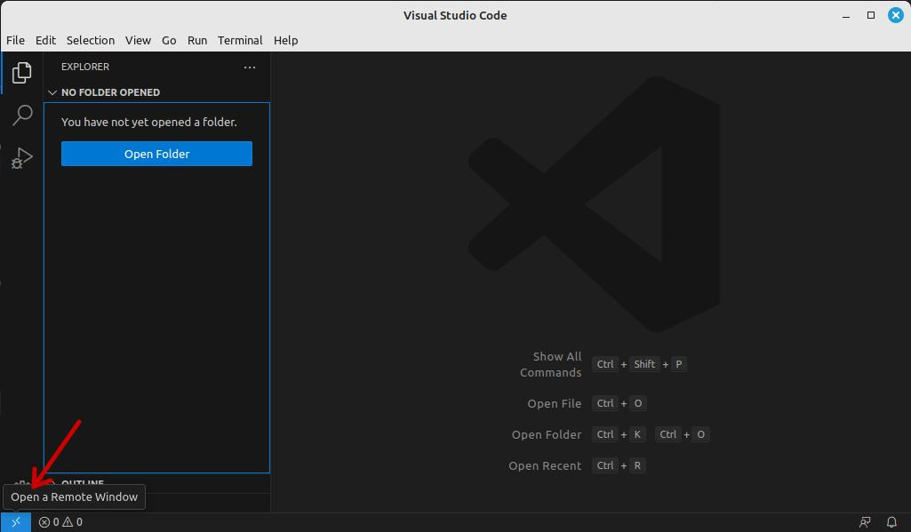
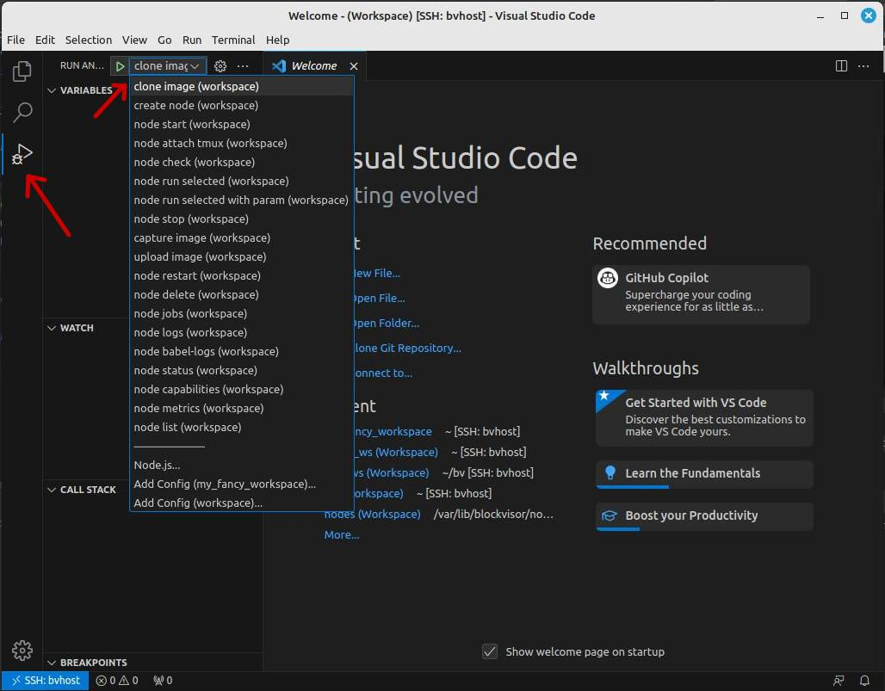

# Node Image Builder Guide

## Introduction

This guide aims to provide the necessary steps a BRE engineer needs to take in order
to add support for a new blockchain type to Blockvisor or update existing node images.
Below instructions is not the only way to create/update node images, but recommended one.
While this guide will describe the steps needed to create an image from scratch,
it is recommended to use the bv image clone feature if the new blockchain requires similar configurations as an existing one
whose image is readily available.

Across this guide, we will refer to the physical machines as HOSTS that will run our different blockchain Firecracker MicroVM which we call NODES.

### Before you start
It is recommended to familiarize with rest of documentation, to get a feel of the concepts, and where the important files are on the hosts and nodes:
- The Blockvisor [README](README.md) provides a list of important paths to remember and suggestive diagrams for the platform.
- The Blockvisor [Host Setup Guide](host_setup_guide.md) provides a how-to for host configuration.
- The [RHAI plugin scripting guide](babel_api/rhai_plugin_guide.md) provides the structure and what functionality the Blockvisor API expects it to provide through Babel API.
- The [Blockchain Data Upload](babel_api/rhai_plugin_guide.md#archive-blockchain-data) chapter provides guidelines to upload a blockchain's data to remote object storage.

### What is Node Image?
Since BV itself is blockchain agnostic, specific blockchain support is plugged-into BV by "Node Image".

Each "Node Image" consists of:
- blockchain `os.img`, that is used to run VM: it is a rootfs containing blockchain specific SW and BV agent (so called babelsup)
- babel plugin that translates BV blockchain agnostic interface (aka Babel API) into blockchain specific calls.

## Prerequisites

- Provisioned host according to [BlockVisor Host Setup Guide](host_setup_guide.md). 

ALTERNATIVELY: Provision host, but without BV installed yet (add `--skip-download` flag to `bvup` call).<br>
Then install [bundle-dev](https://github.com/blockjoy/blockvisor/releases/latest) on the host (instead of standard `bundle`).
Download, untar, and run `./bundle/installer`.<br>
`bundle-dev` is a special variant of BV with `blockvisord` that runs in, so called, "standalone" mode.
It means no regular cloud communication (only when need to download existing images) and commands handling.
Also, other housekeeping tasks, like node recovery, metrics gathering or auto update, are disabled in that variant.<br>
This variant may be more convenient in some cases.

- [optional] VS Code installed on developer PC, with following extensions installed:
    - "Remote - SSH"
    - "Rhai Language Support"
    - "F5 Anything"

VS Code is useful especially for editing rhai script (has pretty good Rhai syntax support),
but can be also handy when running typical actions on a node.  

## Typical Workflow

### Prepare workspace

Workspace is a convenient way to work with concrete image and node.
To create BV workspace run `bv workspace create <WORKSPACE_NAME>`.
While running `bv` commands from workspace directory, you can skip image and node ids.
Creating/cloning image while being in workspace set it automatically as active one,
but you can always change it with `bv workspace set-active-image <image_id>`. The same is with nodes, `bv node create`
set node automatically as active one, but it can always changed with `bv set-active-node <node id or name>`.

Follow below steps to create and use workspace from VS Code.
1. Open remote session in your VS Code.
<br>
2. Open new terminal and create BV workspace with `bv workspace create <WORKSPACE_NAME>`, e.g. `bv workspace create example`.
3. In VS Code "File -> Open Wrokspace from File..." `example/.code-workspace`. 
4. In "Run and Debug" menu several configurations should show up. See `example/.code-workspace` for more details.
<br>

### Create or Clone Image

First, we need to create the image that the node will run. 
Use predefined "Run and Debug" or `bv image` CLI to create/clone node image. E.g.:
```shell
bv image clone algorand/validator/0.0.1 example/node/1.2.3
```
or
```
bv image create example/node/1.2.3 --rootfs-size 20
```

__HINT 1__: You can check that the image is created by running `ls -al /var/lib/blockvisor/images/example/node/1.2.3`

__HINT 2__: If image is created/cloned while in bv workspace directory, it is set as active image, and you don't need to pass
`[IMAGE_ID]` argument to other `bv` commands (since it will fallback to active one).

Now set a root password for your newly created node:
```
mount -o loop /var/lib/blockvisor/images/example/node/1.2.3/os.img /mnt
chroot /mnt /usr/bin/passwd (get password from 1password)
umount /mnt
```

### Create Node

Once image is created, it can be used to create a node instance with standard `bv node create` CLI
(Again predefined "Run and Debug" can be used as well).


__HINT 1__: If node is created while in bv workspace directory, it is set as active node, and you don't need to pass
`[NODE_ID_OR_NAME]` argument to other `bv` commands (since it will fall back to active one).
Additionally `babel.rhai` symbolic link is created. It points to rhai script instance used by active node.

__HINT 2__: You can check what blockvisor is doing on the host by running `journalctl -u blockvisor -fn 50`.

__HINT 3__: The `bv node create` command copy RHAI script from active image (e.g. `/var/lib/blockvisor/images/example/node/1.2.3/babel.rhai`)
to `/var/lib/blockvisor/nodes/<image_id>.rhai`. Hence, editing `babel.rhai` from image won't affect created node.

__HINT 4__: When using standard (not `dev`) BV bundle, it is recommended to use `--standalone` flag,
while adding support for a new node. All commands, run on a node created in standalone mode, will bypass the API.
Hence, node won't be visible for the API, as it would normally be.

__HINT 5__: Once created node is started, `tmux` can be used, to modify rootfs and install/update blockchain specific software.
<br>Adding below alias to your `~/.bashrc` will allow you to quickly attach `tmux` to it (don't forget to install `jq` first):
```
alias tma='tmux attach -t $(cat .bv-workspace |jq .active_node.name| xargs)'
```
Now doing `tma` in your workspace folder will attach you to the active node's tmux.

#### Example
```
bv node create --network test --standalone
```
Check that your node has been created:
```
root@bvhost:~/workspaces/example# bv node ls
-----------------------------------------------------------------------------------------------------------------------------------
 ID                                    Name                        Image                       State    IP Address      Uptime (s)
 c1855039-c2b6-472a-a7bd-4b82c51eb613  recently_enough_cowbird     example_image/node/1.2.3   Stopped  64.140.168.131  -
-----------------------------------------------------------------------------------------------------------------------------------
```

### Add Required Binaries and Snapshots

First you need to provision the binaries and configurations needed for the blockchain you're adding support for.

Below steps should be considered generic and suitable for any blockchain:
- Identify the documentation for the project you're trying to add support for.
- Discern what kind of node you want to add as different types of nodes will imply different approaches (Light/Full/Archive).
- Use `tmux` to attach to the node and go through the blockchain specific installation as you would normally do on any machine.
- Ensure all the binaries recommended in the documentation are compiled/installed properly on the node.
- Look through the documentation and try to find any Blockchain provided snapshots;
especially when running archive nodes, it can take weeks to sync a node to the tip of the chain
without first downloading snapshots of the blockchain data.
- Attempt to start the binaries manually with all the required arguments according to the network,
type of node and customer needs
  - we're purposefully avoiding any startup mechanisms like systemd,
  since the Babel will take care of running the binaries through the jobs we'll configure
- Once the binaries and the blockchain data are in place, and you have a sense of what it means to run nodes
on different networks of the same blockchain, you can move on to implement/customize Babel Plugin (rhai script).

Also make sure that following tools, required by Babel, are available:
- `fallocate`
- `fuser`

### Implementing/Customizing Babel Plugin for New Blockchain

Once you've created the node, you should be able to find it's rhai script in `/var/lib/blockvisor/nodes/<node_id>.rhai`.
This file is automatically symlinked into workspace dir as `babel.rhai`.

__WARNING__: Pay attention to what you're editing - Rhai scripts in `/var/lib/blockvisor/nodes/<node_id>.rhai`
are what's actually running on the nodes, not the ones in `/var/lib/blockvisor/images`.
<br>It is strongly recommended to use VS Code and workspace with auto-generated symlinks to avoid misuse. 

__NOTE 1__: All of Rhai functions can be immediately tested, just after file is saved (including `init()` function).
Use `bv node run <METHOD>` to run specific Rhai function from script.

__NOTE 2__: Use `bv node check` for quick `babel.rhai` script smoke tests.
<br>It executes set of build in functions and all other functions that starts with `test_` prefix.
This can be used to implement blockchain specific a'la unit tests, that will validate other functions output and throw
exception when assertion fail.
**Example:**
```
fn test_height_value(param) {
    if height() < 0 {
        throw "Invalid node height value: " + height();
    }
}
```

__NOTE 3__: Experimenting with `init()` function may result in some unwanted jobs running.
Use `bv n job` CLI to stop or cleanup unwanted jobs.
<br>See `bv n job --help` for more details.

Go to [Rhai Plugin Scripting Guide](babel_api/rhai_plugin_guide.md) for further details
on how to properly implement Babel Plugin in Rhai language.

### Capture and Upload Image

All changes applied on the node are NOT automatically propagated to its source image. Therefore, once node changes are done,
`bv image capture` must be called, so all changes are applied to source image.

__NOTE 1__: Sometimes running node generates files (e.g. cache) in rootfs that should not go into the captured image.
All that files can be excluded using `/etc/bvignore` file (on rootfs), which format is the same as `.gitignore`.

Updated image can be now used again to create fresh node for final testing (e.g. `init()` function).

Once everything is verified, use `bv image upload` to easily put image files on R2.
<br>You will need to export the `AWS_ACCESS_KEY_ID` and `AWS_SECRET_ACCESS_KEY` for R2.

See `bv image upload --help` for more details.

#### Example
```
root@bvhost:~/workspaces/example# bv image capture
root@bvhost:~/workspaces/example# export AWS_SECRET_ACCESS_KEY=***;export AWS_ACCESS_KEY_ID=***
root@bvhost:~/workspaces/example# bv image upload
Uploading babel.rhai to cookbook-dev/chains/example/node/1.2.3/babel.rhai ...
Archiving os.img ...
Uploading blockjoy.gz to cookbook-dev/chains/example/node/1.2.3/blockjoy.gz ...
```

__NOTE 2__: Before you can use the newly updated image, its version needs to be added to the API (ask the dev team for assistance about it).

__Congratulations, you have just added new blockchain support, to the great BlockJoy ecosystem!__