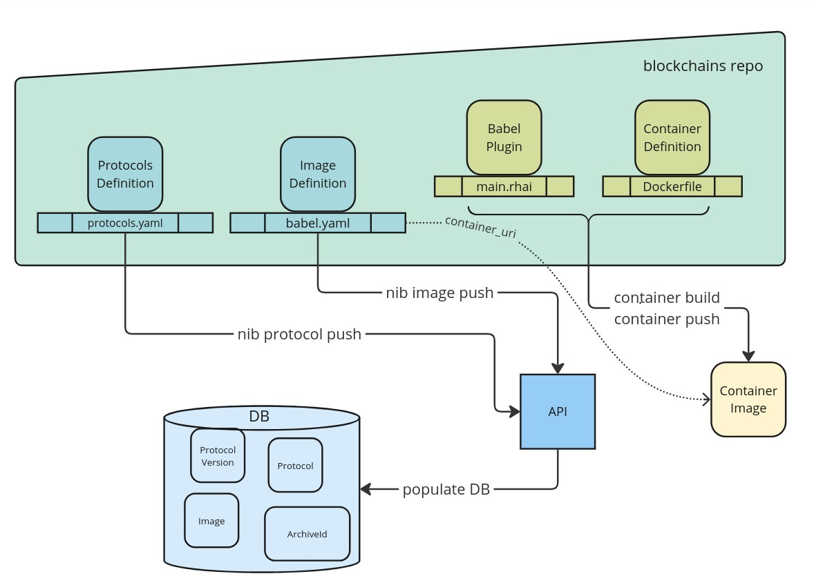

# Node Image Builder Guide

## Introduction

This guide aims to provide the necessary steps a BRE engineer needs to take in order
to add support for a new protocol type to Blockvisor or update existing node images.
Below instructions is not the only way to create/update node images, but recommended one.

Across this guide, we will refer to the physical machines as HOSTS that will run our different protocol Apptainer containers which we call NODES.

### Before you start
It is recommended to familiarize with rest of documentation, to get a feel of the concepts, and where the important files are on the hosts and nodes:
- The Blockvisor [README](README.md) provides a list of important paths to remember and suggestive diagrams for the platform.
- The Blockvisor [Host Setup Guide](host_setup_guide.md) provides a how-to for host configuration.
- The [RHAI plugin scripting guide](babel_api/rhai_plugin_guide.md) provides the structure and what functionality the Blockvisor API expects it to provide through Babel API.
- The [Protocol Data Upload](babel_api/rhai_plugin_guide.md#protocol-data-archives) chapter provides guidelines to upload a protocol's data to remote object storage.

### What is Node Image?
Since BV itself is protocol agnostic, specific protocol support is plugged-into BV by "Node Image".

Each "Node Image" consists of:
- Container image, typically defined by `Dockerfile` and pushed to some registry.
- Babel plugin that translates BV protocol agnostic interface (aka Babel API) into protocol specific calls.
  Plugin code shall be included in container image.
- Image metadata that let Blockvisor API understand image properties and its place in the Blockjoy ecosystem.

## Prerequisites

- Provisioned host according to [BlockVisor Host Setup Guide](host_setup_guide.md), but without BV installed yet (add `--skip-download` flag to `bvup` call).<br>
Then install [bundle-dev](https://github.com/blockjoy/blockvisor/releases/latest) on the host (instead of standard `bundle`).
Download, untar, and run `./bundle/installer`.<br>
`bundle-dev` includes `nib` (Node Image Builder) tool and a special variant of BV with `blockvisord` that runs in, so called, "dev" mode.
It means no regular cloud communication (only when need to download existing images) and commands handling.
Also, other housekeeping tasks, like node recovery, metrics gathering or auto update, are disabled in that variant.<br>

- `nib` tool connected to the API. Use `nib login <USER_ID>` command with `USER_ID` that can be found in web frontend. 
  You will be also asked for associated email and password. Use `--api='<api_url>'` option to connect non-default API instance.
  
  See `nib login --help` for more details.

- [optional] VS Code installed on developer PC, with following extensions installed:
    - "Remote - SSH"
    - "Rhai Language Support"
    - "F5 Anything"

VS Code is useful especially for editing rhai script (has pretty good Rhai syntax support),
but can be also handy when running typical actions on a node.  

## Typical Workflow



### Create Protocol

Node images are grouped by protocols they implement. Hence, the first step is to add protocols metadata definition
and push it to the API (with `nib` CLI).
Protocols are typically defined in `protocols.yaml` file in a top directory, since they are common for multiple images.

```shell
nib protocol push
```

### Create Image

First, we need to create the image that the node will run. 
Use `nib image create <PROTOCOL_KEY> <IMAGE_KEY>` CLI to create node image blueprint.
Protocol and image keys shall be lower-kebab-case.

```shell
nib image create protocol-key variant-key
```

Above command will create subdirectory named `protocol-key_variant-key` with following files inside:
- `Dockerfile` - Blueprint of recipe how to build node rootfs with all necessary binaries.
- `main.rhai` - Blueprint of plugin main file. See comments inside for more details. Shall be included in docker image.
- `babel.yaml` - Blueprint of image metadata file. See comments inside for more details.

### Create Dev Node

To create fist node image:

1. Build docker image `docker build -t variant-key .`
2. Update image metadata in `babel.yaml` file.
In particular, set `container_uri` to `docker-daemon://variant-key:latest`
3. Run some basic sanity checks on the image `nib image check`. Use `--lint-only` option to limit checks to Rhai script only,
otherwise `nib image check` will create dev node, and run also runtime checks. See `nib image check --help` for full list of check and the defaults.
4. Use `nib image play --props '{"property_key":"some property value"}'` to create dev node.

### Add Required Binaries and Snapshots

First you need to provision the binaries and configurations needed for the protocol you're adding support for.

Below steps should be considered generic and suitable for any protocol:
- Identify the documentation for the project you're trying to add support for.
- Discern what kind of node you want to add as different types of nodes will imply different approaches (Light/Full/Archive).
- Use `bv node shell` to attach to the node and go through the protocol specific installation as you would normally do on any machine.
- Ensure all the binaries recommended in the documentation are compiled/installed properly on the node.
- Look through the documentation and try to find any protocol provided snapshots;
especially when running archive nodes, it can take weeks to sync a node to the tip of the chain
without first downloading snapshots of the protocol data.
- Attempt to start the binaries manually with all the required arguments according to the network,
type of node and customer needs
  - we're purposefully avoiding any startup mechanisms like systemd,
  since the Babel will take care of running the binaries through the jobs we'll configure

Finally, having knowledge gained in previous steps, go back to `Dockerfile` and update it with all necessary steps
to prepare sufficient node rootfs.

__NOTE__: It is strongly recommended to put all common definition into some base docker image and then
reuse it in node specific `Dockerfile`s. Base docker images may also contain common babel plugin code
e.g. common auxiliary services definition.
See [Base Example](babel_api/examples/base.rhai) for more details.

__HINT 1__: You can check what blockvisor is doing on the host by running `journalctl -u blockvisor -fn 50`.

### Implementing/Customizing Babel Plugin for New Protocol

Once the binaries and the protocol data are in place, and you have a sense of what it means to run nodes
on different networks of the same protocol, you can move on to implement/customize Babel Plugin (rhai script).

BV expect to find plugin code in:
</br>`/var/lib/blockvisor/<node_id>/rootfs/var/lib/babel/plugin/`

Entrypoint is always `main.rhai` file, but other files from the same dir can be imported using
standard `import` statement (see [The Rhai Book](https://rhai.rs/book/language/modules/import.html)).

Rhai code can be split not only into multiple file, but also multiple container images.
Important thing is that they all ends up in `plugin` dir.

```dockerfile
COPY ./helpers.rhai /var/lib/babel/plugin/
COPY ./main.rhai /var/lib/babel/plugin/
```

__WARNING__: Pay attention to what you're editing - `*.rhai` files are copied into the container image used to create node.
Hence, editing `*.rhai` files from image dir won't affect created node.
</br>If you want change `*.rhai` files for specific  node, then look for them in
`/var/lib/blockvisor/<node_id>/rootfs/var/lib/babel/plugin/`.

__NOTE 1__: All of Rhai functions can be immediately tested, just after file is saved (including `init()` function).
Use `bv node run <METHOD>` to run specific Rhai function from script.

__NOTE 2__: Use `nib image check plugin` for quick `babel.rhai` script smoke tests and other sanity checks.

__NOTE 3__: Experimenting with `init()` function may result in some unwanted jobs running.
Use `bv n job` CLI to stop or cleanup unwanted jobs.
<br>See `bv n job --help` for more details.

Go to [Rhai Plugin Scripting Guide](babel_api/rhai_plugin_guide.md) for further details
on how to properly implement Babel Plugin in Rhai language.

#### Define Auxiliary Services as needed

You can define auxiliary services that will be automatically started on nodes via `aux_services` field
in `plugin_config`. It is the place to define protocol unrelated services like monitoring agent or proxy servers.

Hence, it is strongly recommended to put `aux_services` definition in a rhai file that will be included
in some base container image. Then it can be imported and used by node specific `main.rhai` scripts.

See [Plugin Config Example](babel_api/examples/plugin_config.rhai) for more details.

__NOTE__: Use `nib image check` to quickly check if node can be created and started.

### Push Image to the API

Test image and make all necessary adjustments. Once it is ready, push container image to registry,
update `container_uri` in `babel.yaml` with final one, and push image to the API:

```shell
nib image push
```

__NOTE__: If you change existing node image, remember to update `version` field.

Once image is pushed to the API, it can be used to create a node instance with standard `bv node create` CLI or web frontend.

Updated image can be now used again to create fresh node for final testing.

__Congratulations, you have just added new protocol support, to the great BlockJoy ecosystem!__
